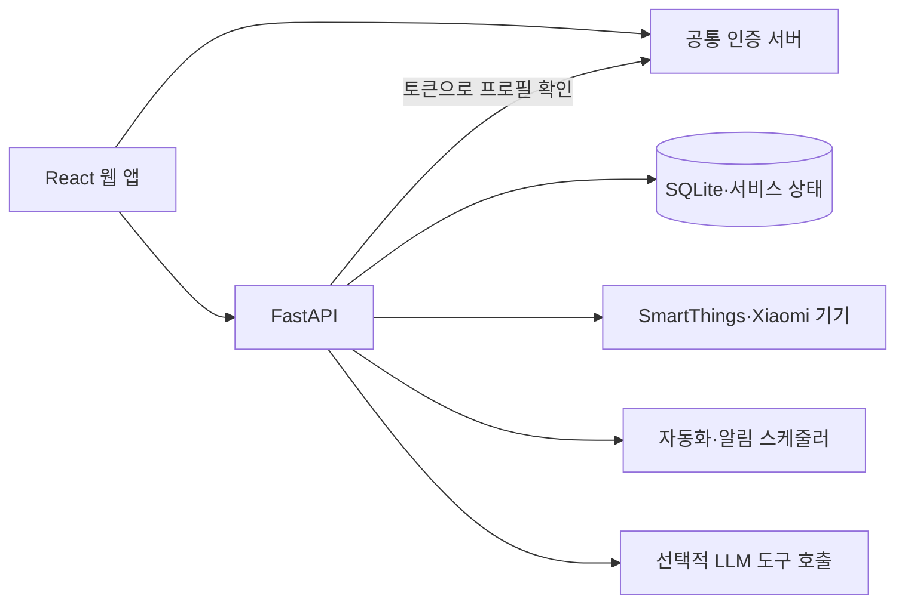

# Smart Home Manager

**기기·자동화·알림을 한 화면에서 관리하는 스마트홈 서비스**

서로 다른 기기 플랫폼에 분산된 상태 확인과 제어를 하나의 웹 인터페이스로 모으기 위해 개발한 개인 서비스입니다. 공통 계정으로 로그인하고, 홈과 구성원·기기·자동화 설정을 서비스 내부에서 관리합니다.

[실행과 환경 설정](docs/SETUP.md) · [공통 인증 서버](https://github.com/ho72/unified-auth-server)

## 주요 기능

| 기능 | 구현 내용 | 코드 |
| --- | --- | --- |
| 기기 관리 | 기기 목록·상태·명령, SmartThings 및 Xiaomi 계열 기기 연동 | [기기 API](backend/router/devices_router.py), [연동 모듈](backend/devices/) |
| 홈·구성원 | 홈 생성·선택, 홈별 구성원·기기 연결 | [홈 API](backend/router/homes_router.py), [저장 로직](backend/home_store.py) |
| 자동화 | 자동화 규칙 저장·수동 실행, 백그라운드 스케줄러 | [자동화 API](backend/router/automations_router.py), [엔진](backend/automation_engine.py) |
| 알림·날씨 | Web Push 구독·설정, 알림 스케줄러, 날씨 조회 | [알림](backend/notifications.py), [날씨](backend/weather.py) |
| 대화형 제어 | OpenRouter를 통한 LLM 채팅과 기기 도구 호출 | [채팅 API](backend/router/llm_router.py), [도구](backend/llm_tools.py) |
| 체중계 데이터 | 수집 API, 측정 이력·사용자 연결·요약 화면 | [체중계 API](backend/router/scale_router.py), [저장 로직](backend/scale_store.py) |

## 기술 구성

- **웹:** React 18, JavaScript, Vite 5, Service Worker
- **API:** Python, FastAPI, uvicorn, requests
- **저장:** SQLite, 서비스 상태 JSON
- **연동:** SmartThings, Xiaomi/python-miio, 기상청 API, OpenRouter, Web Push

## 구조와 설계



- 프론트엔드는 공통 인증 서버의 access/refresh token을 관리하고, API 요청에 Bearer token을 붙입니다. 토큰 갱신 요청은 백엔드를 통해 인증 서버로 전달합니다.
- 백엔드는 `/auth/me`로 공통 계정을 확인하고 서비스 내부 사용자·역할로 정규화합니다. 관리자 설정과 홈·기기 상태는 이 서비스가 관리합니다.
- SmartThings·Xiaomi 등 기기별 연동은 API 라우터·기기 모듈로 나누고, 자동화·알림을 별도 백그라운드 작업으로 실행합니다.

```text
src/            API 클라이언트와 웹 진입점
mobile/         기본 진입 화면을 구성하는 React 컴포넌트
components/     추가 화면·공유 컴포넌트
backend/router/ FastAPI 기능별 라우터
backend/devices/ 기기 플랫폼 연동
public/         아이콘·Service Worker
.env.example    로컬 설정 예시
```

## 실행

Node.js 22, npm, Python 3.12와 공통 인증 서버를 기준으로 확인했습니다.

```bash
git clone https://github.com/ho72/smart-home-manager.git
cd smart-home-manager
npm ci
cp .env.example .env
```

[실행 안내](docs/SETUP.md)에 따라 Python 의존성을 설치하고 백엔드와 웹을 각각 시작합니다. 웹은 `http://localhost:5173`, API는 `http://localhost:8080`을 사용합니다. 실제 기기 제어는 자신의 기기와 플랫폼 인증 설정을 준비한 뒤 사용할 수 있습니다.

## 확인한 범위

임시 계정을 사용한 연결 검증에서 공통 access token으로 프로필·홈 목록을 조회하고, 인증 없는 요청과 유효하지 않은 토큰을 거부하는 것을 확인했습니다. 체중계 장치 등록 응답의 기본 수집 주소도 HTTP POST 라우트와 일치하도록 확인했습니다.

2026-10-06 공개 코드 기준으로 `npm run build`와 Python 소스 32개 문법 검사가 통과했습니다. Node.js 22.22.2, Python 3.12.14에서 확인했습니다.

기기 계정·토큰·기기 식별정보와 개인 측정 기록은 저장소에 포함하지 않습니다. 실제 기기 제어, LLM 호출, 날씨 조회, Web Push 전송은 외부 설정과 장비가 필요한 기능이며 이번 검증에서 실행하지 않았습니다. Python 의존성 버전은 현재 `requirements.txt`에서 고정하지 않습니다.

## 함께 사용하는 서비스

| 저장소 | 역할 |
| --- | --- |
| [unified-auth-server](https://github.com/ho72/unified-auth-server) | 공통 계정·소셜 로그인·토큰 발급 |
| [home-media-sharing](https://github.com/ho72/home-media-sharing) | 사진·영상·파일 공유 |
| [ai-coding-workspace](https://github.com/ho72/ai-coding-workspace) | 브라우저 기반 AI 개발 워크스페이스 |
